# ProCreate Diffusion

### [Paper](https://arxiv.org/abs/2408.02226) | [Project Page](https://procreate-diffusion.github.io/) | [FSCG-8 Dataset](https://huggingface.co/datasets/Jacklu0831/few-shot-creative-generation-8)

Public code release for the paper "ProCreate, Don’t Reproduce! Propulsive Energy Diffusion for Creative Generation" (ECCV 2024).


## Setup

Download and set up the repo:
```bash
git clone https://github.com/Agentic-Learning-AI-Lab/procreate-diffusion-public.git
cd procreate-diffusion-public
```

Install requirements:
```bash
pip install -r requirements.txt
```

## Dataset FSCG-8

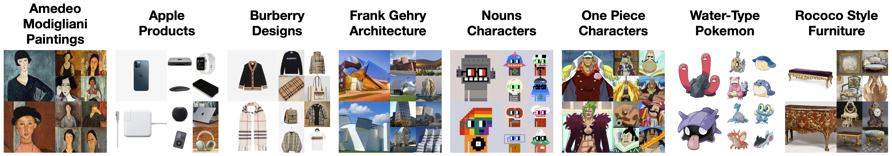
The FSCG-8 dataset is locally stored under `few-shot-creative-generation-8`. FSCG-8 can also be loaded from Huggingface as [Jacklu0831/few-shot-creative-generation-8](https://huggingface.co/datasets/Jacklu0831/few-shot-creative-generation-8).

## Training

The following command fine-tunes a Stable Diffusion checkpoint on Amedeo Modigliani paintings. To fine-tune on other FSCG-8 categories, see commands in `commands_train.sh`. You can also collect your own few-shot caption-image pairs and put them under `dataset_dir`.

```bash
python src/train.py \
    --output_dir temp \
    --dataset_dir few-shot-creative-generation-8/amedeo_modigliani \
    --enable_xformers_memory_efficient_attention \
    --allow_tf32
```

## Sampling

The following command runs ProCreate sampling for the prompt "*a Amedeo Modigliani painting of a boy in a suit and hat*" from a Stable Diffusion checkpoint that is fine-tuned on Amedeo Modigliani paintings. `src/inference.py` automatically downloads the [model weights from Huggingface](https://huggingface.co/Jacklu0831/procreate-diffusion-amedeo-modigliani).

```bash
python src/inference.py \
    --dataset_dir few-shot-creative-generation-8/amedeo_modigliani \
    --unet_ckpt_dir Jacklu0831/procreate-diffusion-amedeo-modigliani \
    --prompt "a Amedeo Modigliani painting of a boy in a suit and hat" \
    --dreamsim_w 250 \
    --max_grad_norm 0.5 \
    --enable_xformers_memory_efficient_attention \
    --allow_tf32
```

Sample outputs:
<p float="left">
  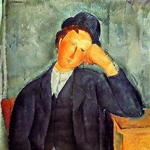
  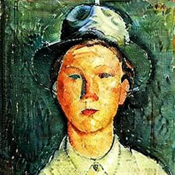
  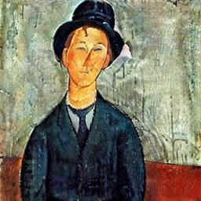
  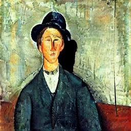
</p>

We also provide a trained checkpoint for each other category in FSCG-8. We use commands in `commands_inference.sh` to display ProCreate samples from each checkpoint.

[Apple checkpoint](https://huggingface.co/Jacklu0831/procreate-diffusion-apple) with prompt "*an Apple VR headset*":
<p float="left">
  
  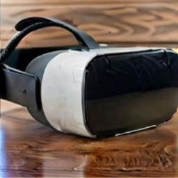
  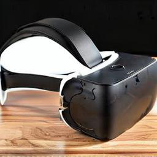
  
</p>

[Burberry checkpoint](https://huggingface.co/Jacklu0831/procreate-diffusion-burberry) with prompt "*a Burberry stuffed bear*":
<p float="left">
  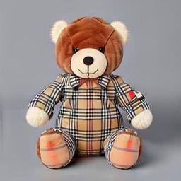
  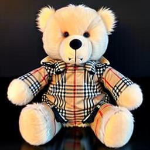
  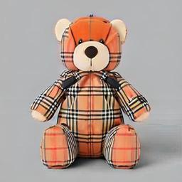
  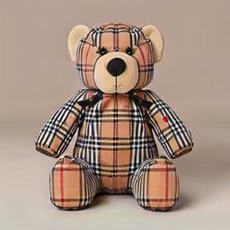
</p>

[Frank Gehry checkpoint](https://huggingface.co/Jacklu0831/procreate-diffusion-frank-gehry) with prompt "*a twisting tall apartment building, designed by Frank Gehry*":
<p float="left">
  
  
  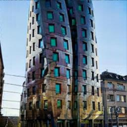
  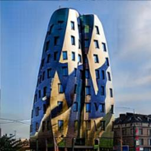
</p>

[Nouns checkpoint](https://huggingface.co/Jacklu0831/procreate-diffusion-nouns) with prompt "*a mountain Nouns character*":
<p float="left">
  
  
  
  
</p>

[One Piece checkpoint](https://huggingface.co/Jacklu0831/procreate-diffusion-one-piece) with prompt "*a One Piece man in a purple robe*":
<p float="left">
  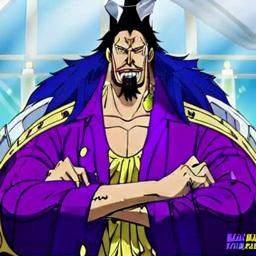
  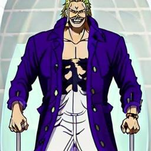
  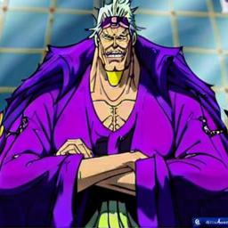
  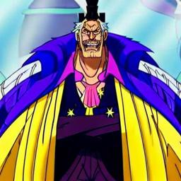
</p>

[Pokemon checkpoint](https://huggingface.co/Jacklu0831/procreate-diffusion-pokemon) with prompt "*a jellyfish Pokemon*":
<p float="left">
  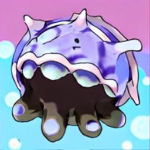
  
  
  
</p>

[Rococo checkpoint](https://huggingface.co/Jacklu0831/procreate-diffusion-rococo) with prompt "*a Rococo style bed*":
<p float="left">
  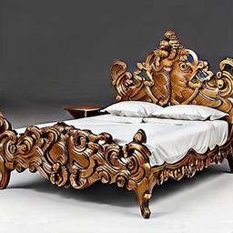
  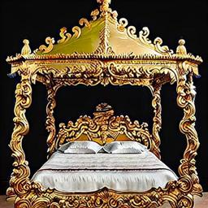
  
  
</p>

## Acknowledgments

The code is adapted from [Huggingface Diffusers](https://github.com/huggingface/diffusers).
